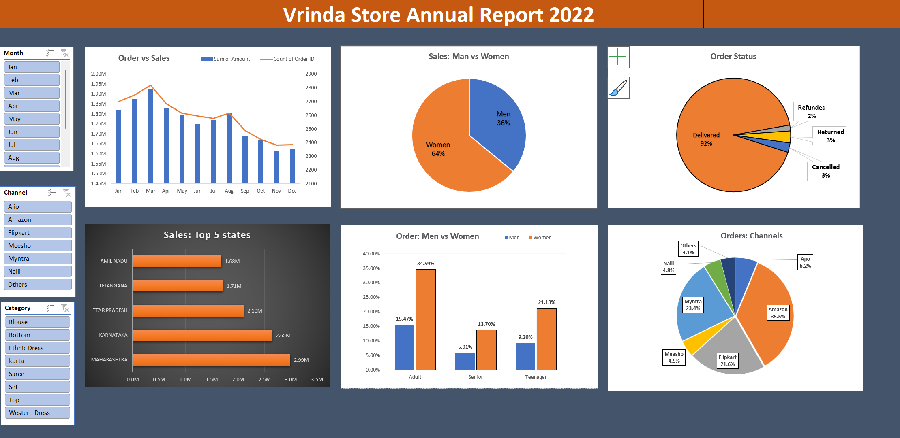

# Vrinda Store Sales Analysis Dashboard (Excel Project)

## Project Overview

This project analyzes the 2022 sales performance of Vrinda Store using Microsoft Excel. The objective was to transform raw sales data into meaningful business insights through data cleaning, processing, analysis, and visualization.

The project demonstrates the use of Excel's data analysis features such as Pivot Tables, Pivot Charts, and Slicers to create an interactive dashboard that helps stakeholders understand sales trends, customer behavior, and channel performance.

---

## Project Objectives

The main objectives of this project were:

- Clean and prepare the raw dataset for analysis.
- Create additional fields to improve analytical capabilities.
- Analyze customer purchasing patterns.
- Identify top-performing sales channels and states.
- Examine the relationship between customer demographics and orders.
- Build an interactive dashboard for business decision-making.

---

## Dataset Description

The dataset contains order-level sales information including:

| Column Name | Description |
|-------------|-------------|
| Order ID | Unique order identifier |
| Cust ID | Customer identifier |
| Gender | Customer gender |
| Age | Customer age |
| Age Group | Customer age category |
| Date | Order date |
| Month | Order month |
| Status | Order status |
| Channel | Sales platform/channel |
| SKU | Product SKU |
| Category | Product category |
| Size | Product size |
| Qty | Quantity ordered |
| Currency | Transaction currency |
| Amount | Order amount |
| Ship City | Customer city |
| Ship State | Customer state |
| Ship Postal Code | Postal code |
| Ship Country | Country |
| B2B | Business-to-business indicator |

---

## Data Cleaning

To ensure accurate analysis, several data cleaning steps were performed.

### Gender Standardization

The Gender column contained inconsistent values:

| Original Value | Updated Value |
|---------------|--------------|
| M | Men |
| W | Women |

These values were standardized to maintain consistency throughout the dataset.

### Quantity Standardization

The Quantity column contained mixed formats:

| Original Value | Updated Value |
|---------------|--------------|
| One | 1 |

This ensured that quantity data could be analyzed correctly.

---

## Data Processing

Additional columns were created to support business analysis.

### 1. Age Group

Customers were categorized into three age groups:

| Age Range | Group |
|------------|--------|
| Below 30 | Teenager |
| 30 – 49 | Adult |
| 50 and Above | Senior |

This classification made demographic analysis easier.

### 2. Month

A Month column was created from the Date field to enable monthly trend analysis and filtering.

---

## Business Questions Answered

The following business questions were analyzed using Pivot Tables and Pivot Charts.

### 1. Compare Sales and Orders Using a Single Chart

Analyzed the relationship between total sales amount and number of orders over time.

### 2. Who Purchased More – Men or Women in 2022?

Compared purchase volume based on customer gender.

### 3. What Are the Different Order Statuses in 2022?

Analyzed the distribution of order statuses such as:

- Delivered
- Cancelled
- Returned
- Refunded

### 4. Top 10 States Contributing to Sales

Identified the states generating the highest sales revenue.

### 5. Relationship Between Age and Gender Based on Number of Orders

Compared purchasing behavior among different age groups and genders.

### 6. Which Channel Contributes the Maximum Sales?

Analyzed sales contribution from channels such as:

- Amazon
- Myntra
- Ajio
- Flipkart
- Meesho
- Nalli
- Others

---

## Dashboard Creation

The dashboard was developed using:

- Pivot Tables
- Pivot Charts
- Slicers
- Excel Formatting Tools

### Interactive Filters (Slicers)

Three slicers were added to make the dashboard interactive:

- Month
- Channel
- Category

Users can filter dashboard results dynamically using these slicers.

---

## Dashboard Preview

### Excel Dashboard



---

## Key Insights

The analysis revealed several important business insights:

- Women contributed more orders than men.
- Adult customers represented the largest customer segment.
- A small number of states generated a significant portion of total sales.
- Certain sales channels contributed substantially more revenue than others.
- Most orders were successfully delivered.
- Monthly sales trends can be analyzed efficiently through dashboard filters.

---

## Tools and Technologies Used

- Microsoft Excel
- Pivot Tables
- Pivot Charts
- Slicers
- Data Cleaning Techniques
- Data Processing and Transformation

---

## Repository Structure

```
Vrinda-Store-Sales-Analysis
│
├── README.md
├── Vrinda_Store_Analysis.xlsx
│
└── images
    └── dashboard.png
```

---

## How to Use

1. Download the Excel file.
2. Open the workbook in Microsoft Excel.
3. Navigate to the Dashboard sheet.
4. Use the Month, Channel, and Category slicers to interact with the dashboard.
5. Explore the charts and insights generated from the sales data.

---

## Learning Outcomes

Through this project, I gained practical experience in:

- Data Cleaning
- Data Transformation
- Pivot Tables
- Pivot Charts
- Dashboard Design
- Business Data Analysis
- Excel Data Visualization

---

## Author

**Omar Faruque Chowdhury**

Excel Data Analysis Project – Sales Dashboard Development
